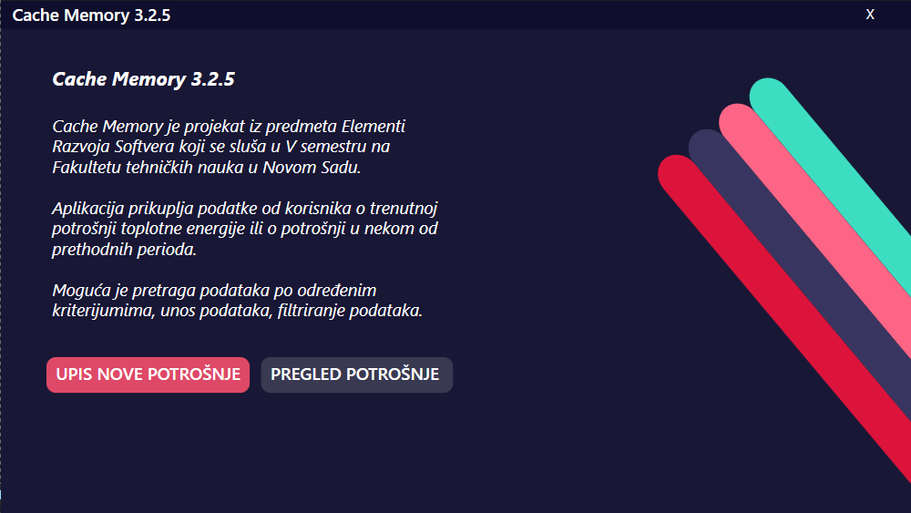
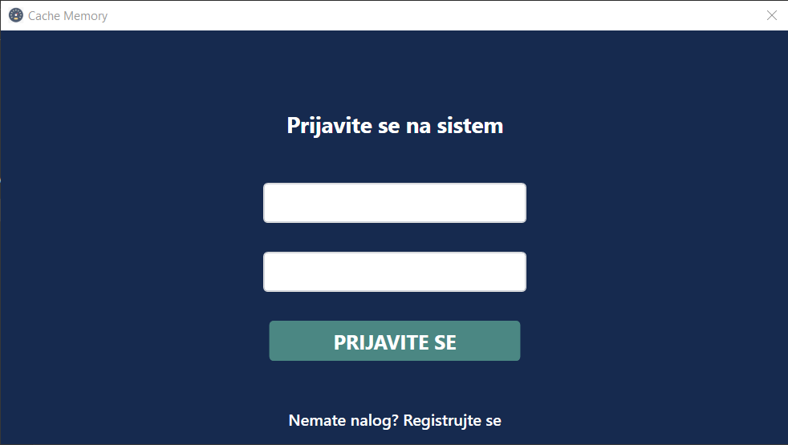
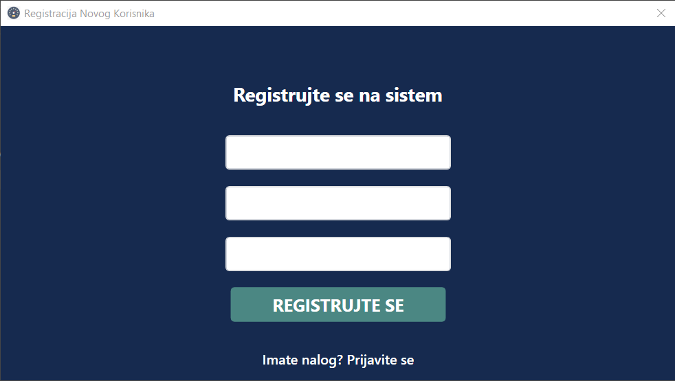
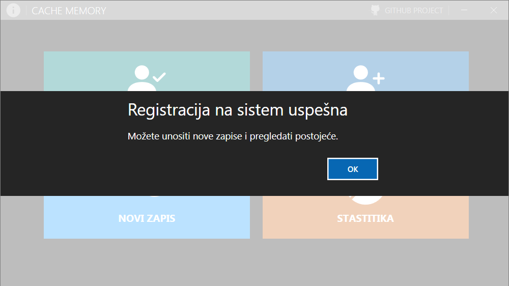
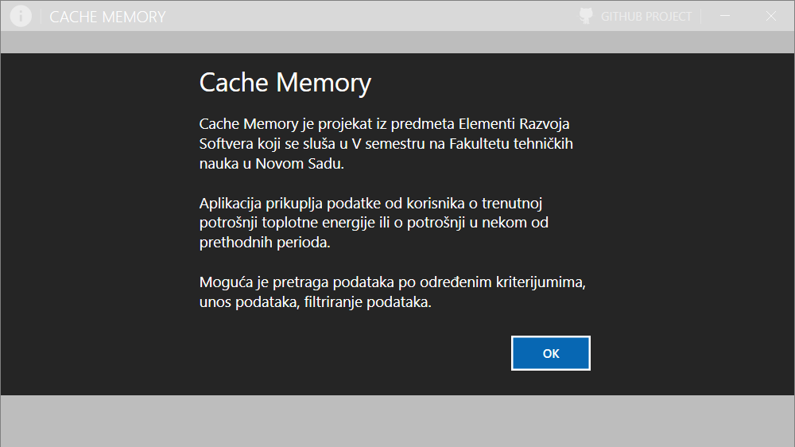

## Cache Memory

#### O Projektu

Cache Memory je projekat iz predmeta Elementi Razvoja Softvera koji se sluša u V semestru na Fakultetu tehničkih nauka u Novom Sadu.  

Aplikacija prikuplja podatke od korisnika o trenutnoj potrošnji toplotne energije ili o potrošnji u nekom od prethodnih perioda. 

## Status Projekta
<ul>
  <li>Implementirati Writer</li>
  <li>Implementirati Dumping Buffer</li>
  <li>Implementirati Historical</li>
  <li>Implementirati Reader</li>
</ul>

## Primer Korišćenja Aplikacije
Projekat je i dalje u početnoj fazi razvoja. Nisu implementirani dodaci.

## Izgled Aplikacije

  

  

  

  

## Pokretanje Projekta
Pokreće se kao Visual Studio projekat.  

## Reflekcija

  - Koji je bio kontekst ovog projekta?
  - Šta ste hteli da sagradite?
  - Zašto je ovaj projekat bio izazovan i samim tim zaista dobro iskustvo učenja?
  - Koje su bile neke neočekivane prepreke?
  - Koje alatke ste koristili za implementaciju ovog projekta?
      - Ovo može izgledati očigledno jer ste u ovoj bazi kodova, ali svim drugim ljudima sada je vreme da pričaju o tome zašto ste izabrali SQLite umesto OracleDB itd.

## Defleksija  

Ovo je bio projekat dug 4 nedelje. Ciljevi projekta podrazumevali su korišćenje tehnologija naučenih do ovog trenutka i upoznavanje sa dokumentacijom za nove funkcije.  

Jedan od glavnih izazova na koje smo naleteli bila je potvrda identiteta. To nas je dovelo do toga da provedemo nekoliko dana na istraživačkom radu o OAuth, Auth0, i autentifikaciji sa dva faktora koristeći SQLite Provider. Zbog vremenskih ograničenja projekta, morali smo da zatražimo potvrdu identiteta i fokusiramo se na vizuelizaciju podataka i delova API-ja koji nisu ograničeni defakto faktore.